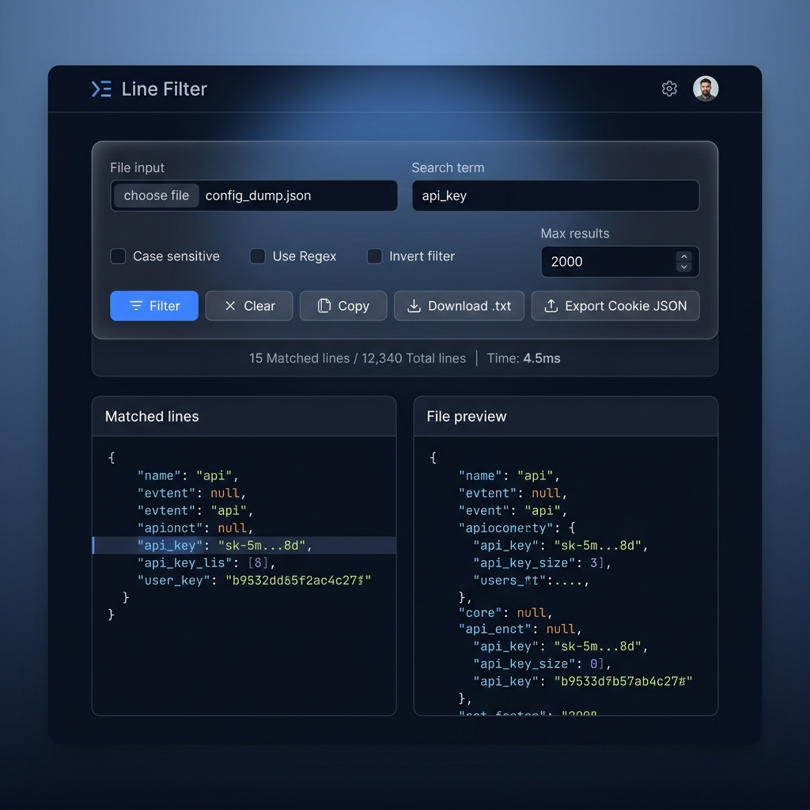
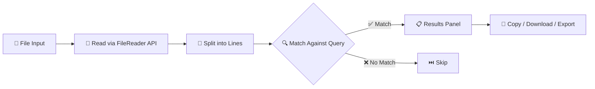

<div align="center">

# 🔍 Line Filter

**A blazing-fast, privacy-first text filtering tool that runs entirely in your browser.**

[](https://opensource.org/licenses/MIT)
[](https://developer.mozilla.org/en-US/docs/Web/HTML)
[](https://developer.mozilla.org/en-US/docs/Web/CSS)
[](https://developer.mozilla.org/en-US/docs/Web/JavaScript)
[](/)
[](https://github.com/khacdai24/line_filter_file/graphs/commit-activity)

<br />

*Search, filter, and export matching lines from any text file — JSON, TXT, LOG, CSV, and more — without ever uploading your data.*

<br />



<br />

[Getting Started](#-getting-started) •
[Features](#-features) •
[Usage](#-usage) •
[How It Works](#-how-it-works) •
[Contributing](#-contributing) •
[License](#-license)

</div>

---

## ⚡ Why Line Filter?

Working with large log files, cookie dumps, or configuration files? Need to quickly find specific lines without spinning up a server or installing heavy software? **Line Filter** was built for exactly this.

| Pain Point | Line Filter Solution |
|---|---|
| 🔐 Privacy concerns with online tools | 100% client-side — **zero data leaves your machine** |
| 🐌 Slow, bloated text editors for large files | Lightweight & instant — handles files up to **25 MB** |
| 🧩 Complex grep/regex setup | Intuitive UI with **one-click regex toggle** |
| 📦 Dependency hell | **Zero dependencies** — just open `index.html` |

---

## ✨ Features

<table>
  <tr>
    <td width="50%">

### 🔎 Smart Filtering
- **Keyword search** with instant results
- **Regular expression** support (JavaScript syntax)
- **Case-sensitive** toggle
- **Invert match** — find lines that do NOT contain the query
- **Result limit** to prevent browser freezing on huge files

</td>
<td width="50%">

### 📤 Powerful Export
- **Copy to clipboard** — paste anywhere instantly
- **Download as `.txt`** — save filtered lines as a file
- **Export as Cookie JSON** — auto-format filtered cookies into structured JSON with domain detection (Facebook, Instagram, Google, TikTok, etc.)

</td>
  </tr>
  <tr>
    <td>

### 🎨 Modern UI
- Sleek **dark theme** with glassmorphism design
- **Responsive layout** — works on desktop & tablet
- **Split-view** — results panel + file preview side by side
- **Sticky header** with real-time statistics

</td>
<td>

### 🛡️ Privacy & Performance
- **Runs 100% in the browser** — no server, no uploads
- **No dependencies** — pure HTML + CSS + JS
- **Large file warning** for files > 25 MB
- **Preserves line endings** (CRLF/LF) in downloads

</td>
  </tr>
</table>

---

## 🚀 Getting Started

### Prerequisites

All you need is a **modern web browser** (Chrome, Firefox, Edge, Safari).

### Installation

```bash
# Clone the repository
git clone https://github.com/khacdai24/line_filter_file.git

# Navigate into the project
cd line_filter_file

# Open in your browser — that's it!
start index.html        # Windows
open index.html         # macOS
xdg-open index.html     # Linux
```

> [!TIP]
> For the best development experience, use **VS Code** with the [Live Server](https://marketplace.visualstudio.com/items?itemName=ritwickdey.LiveServer) extension for hot reloading.

---

## 📖 Usage

### Basic Workflow

```
1. 📂 Load a file     →  Click "File input" and select any text-based file
2. 🔍 Enter a query   →  Type your search term in the filter field
3. ⚙️ Set options     →  Toggle case sensitivity, regex, or inverse mode
4. 🚀 Click "Filter"  →  Matching lines appear instantly in the results panel
5. 💾 Export results   →  Copy, download as .txt, or export as Cookie JSON
```

### Filtering Modes

| Mode | Description | Example |
|---|---|---|
| **Plain Text** | Simple substring matching | `error` matches any line containing "error" |
| **Regex** | JavaScript RegExp patterns | `\berror\b` matches "error" as a whole word |
| **Case Sensitive** | Exact case matching | `Error` won't match "error" |
| **Invert** | Exclusion filter | Returns lines that do **NOT** contain the query |

### Cookie Export (Advanced)

Line Filter includes a specialized **Cookie JSON Export** feature designed for cookie management workflows:

1. Load a cookie dump file (`.json` or `.txt`)
2. Filter by domain (e.g., type `facebook`)
3. Click **"Export Cookie JSON"**
4. The tool automatically:
   - Parses each matching line as a JSON object
   - Detects the target domain from your search query
   - Wraps cookies in a structured `{ url, cookies }` format
   - Downloads as `exported-cookies.json`

**Supported domain auto-detection:**

| Search Query Contains | Exported URL |
|---|---|
| `facebook` | `https://www.facebook.com` |
| `instagram` | `https://www.instagram.com` |
| `google` / `gmail` | `https://myaccount.google.com` |
| `tiktok` | `https://www.tiktok.com` |
| *(other)* | `https://www.facebook.com` *(default)* |

---

## 🔧 How It Works



### Architecture

```
line_filter_file/
├── index.html      # App structure & semantic markup
├── styles.css      # Dark theme with CSS custom properties & glassmorphism
├── app.js          # Core filtering engine & DOM interactions
├── assets/
│   └── screenshot.png
└── README.md
```

### Technical Highlights

- **Zero-dependency architecture** — no npm, no bundler, no framework
- **FileReader API** for client-side file processing
- **Dynamic RegExp construction** with proper flag handling
- **Blob API** for generating downloadable files on the fly
- **Clipboard API** for seamless copy-to-clipboard
- **Responsive CSS Grid** with mobile breakpoints at 900px
- **Line ending preservation** — auto-detects CRLF vs LF

---

## 🌐 Browser Support

| Browser | Supported |
|---|---|
| Chrome 80+ | ✅ |
| Firefox 78+ | ✅ |
| Edge 80+ | ✅ |
| Safari 14+ | ✅ |
| Opera 67+ | ✅ |
| IE 11 | ❌ |

---

## 🤝 Contributing

Contributions are welcome! Here's how you can help:

1. **Fork** the repository
2. **Create** a feature branch (`git checkout -b feature/amazing-feature`)
3. **Commit** your changes (`git commit -m 'Add amazing feature'`)
4. **Push** to the branch (`git push origin feature/amazing-feature`)
5. **Open** a Pull Request

### Ideas for Contribution

- [ ] Multi-keyword filtering (comma or pipe separated)
- [ ] Syntax highlighting for matched terms
- [ ] Drag-and-drop file upload
- [ ] Dark/Light theme toggle
- [ ] File encoding detection (UTF-8, UTF-16, etc.)
- [ ] Search history / recent queries

---

## 📝 License

This project is licensed under the **MIT License** — see the [LICENSE](LICENSE) file for details.

---

<div align="center">

**Made with ❤️ by [@khacdai24](https://github.com/khacdai24)**

⭐ If you found this useful, consider giving the repo a star!

</div>
